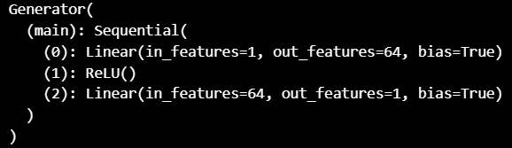
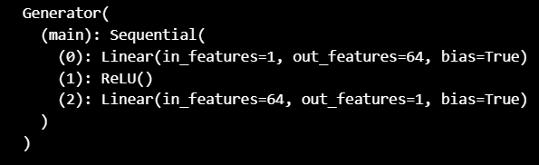
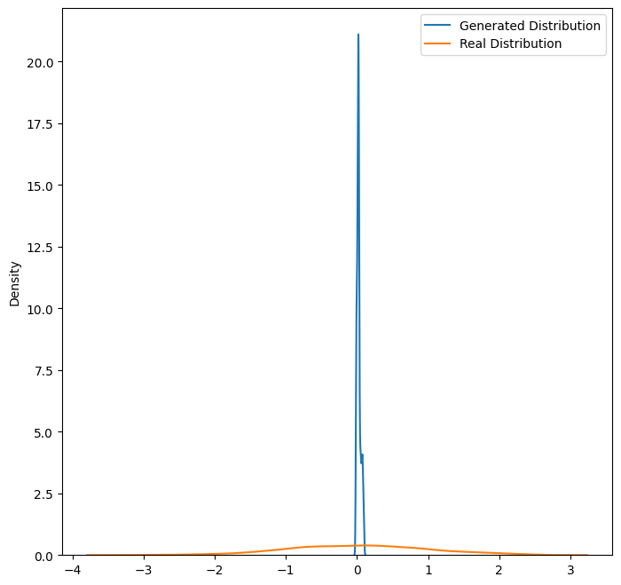
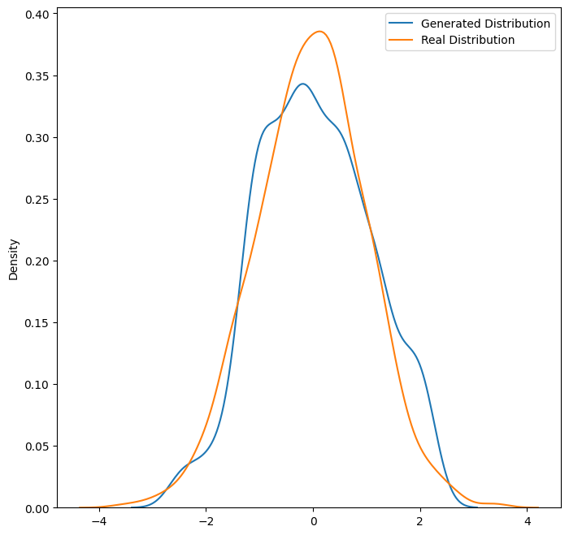

# GAN

# Simple GAN
using normal distribution for real data and using uniform distribution for generator input

generator:

discriminator:

first real data and generator output:

last real data and generator output:

